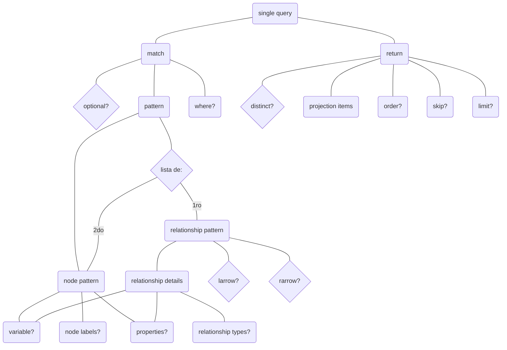
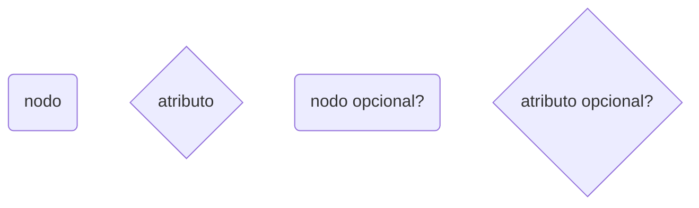

```mermaid
graph TD
    A(single query) --- B(match)
    A --- C(return)
    B --- D{optional?}
    B --- E(pattern)
    B --- F(where?)
    E --- G(node pattern)
    E --- H{lista de:}
    H --- |1ro| I(relationship pattern)
    H --- |2do| G
    G --- J(variable?)
    G --- K(node labels?)
    G --- L(properties?)
    I --- M(relationship details)
    I --- N{larrow?}
    I --- O{rarrow?}
    M --- J
    M --- Q(relationship types?)
    M --- L
    C --- R{distinct?}
    C --- S(projection items)
    C --- T(order?)
    C --- U(skip?)
    C --- V(limit?)
```

## Legend

```mermaid
graph TD
    A(nodo)
    B{atributo}
    C(nodo opcional?)
    D{atributo opcional?}
```