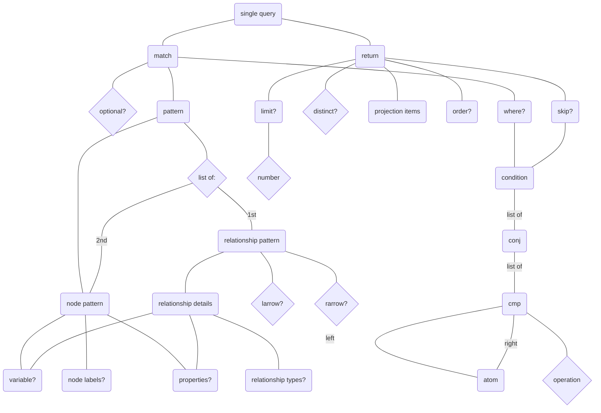
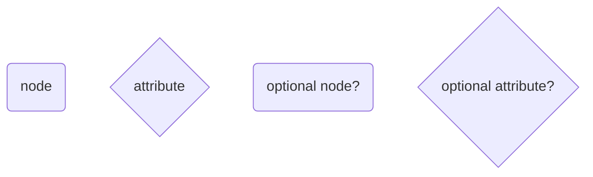

```mermaid
graph TD
    A(single query) --- B(match)
    A --- C(return)
    B --- D{optional?}
    B --- E(pattern)
    B --- F(where?)
    F --- X
    E --- G(node pattern)
    E --- H{list of:}
    H --- |1st| I(relationship pattern)
    H --- |2nd| G
    G --- J(variable?)
    G --- K(node labels?)
    G --- L(properties?)
    I --- M(relationship details)
    I --- N{larrow?}
    I --- O{rarrow?}
    M --- J
    M --- Q(relationship types?)
    M --- L
    C --- R{distinct?}
    C --- S(projection items)
    C --- T(order?)
    C --- U(skip?)
    U --- X(condition)
    X --- |list of| Z(conj)
    Z --- |list of| Cmp(cmp)
    Cmp --- |left| Atom(atom)
    Cmp --- |right| Atom(atom)
    Cmp --- CmpOper{operation}
    C --- V(limit?)
    V --- W{number}
```

## Legend

```mermaid
graph TD
    A(node)
    B{attribute}
    C(optional node?)
    D{optional attribute?}
```