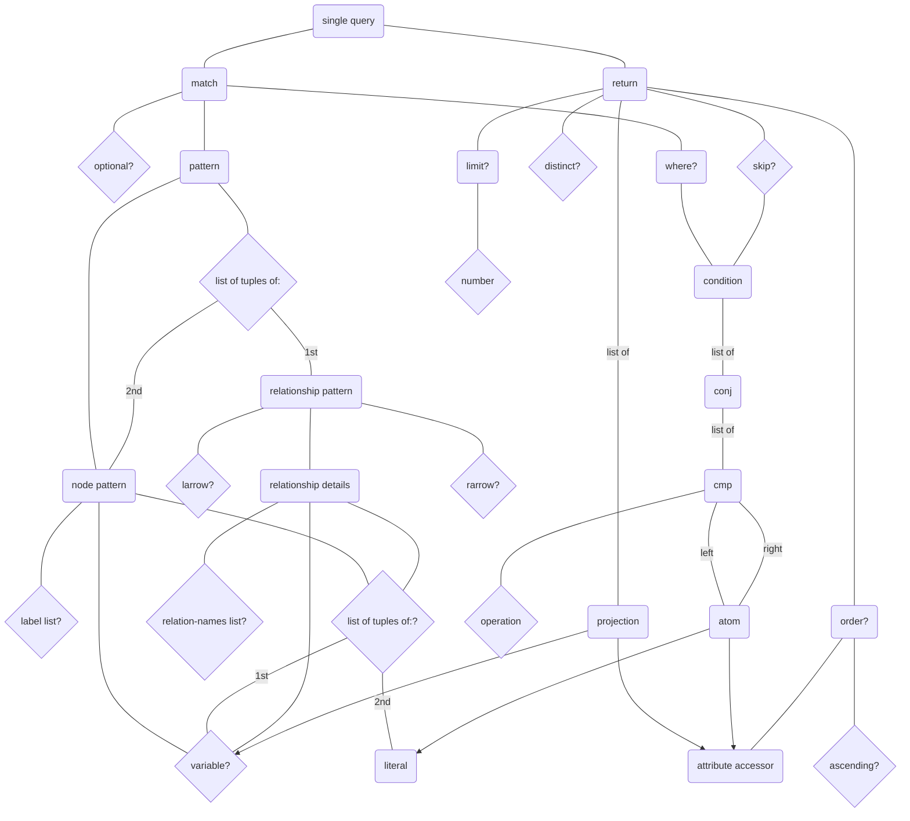
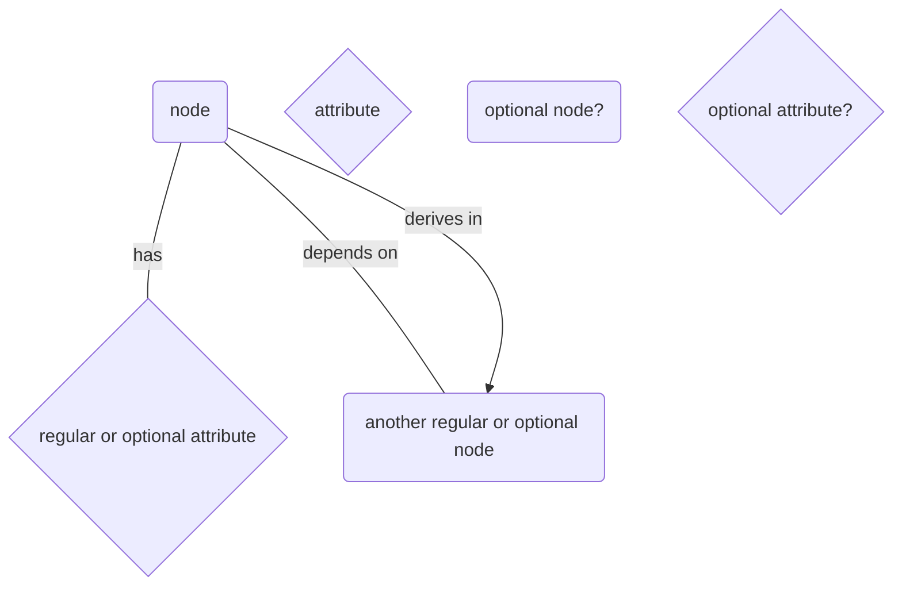

```mermaid
graph TD
    A(single query) --- B(match)
    A --- C(return)
    B --- D{optional?}
    B --- E(pattern)
    B --- F(where?)
    F --- X
    E --- G(node pattern)
    E --- H{list of tuples of:}
    H --- |1st| I(relationship pattern)
    H --- |2nd| G
    G --- J{variable?}
    G --- K{label list?}
    G --- L{list of tuples of:?}
    L --- |1st| J
    L --- |2nd| Lit
    I --- N{larrow?}
    I --- M(relationship details)
    I --- O{rarrow?}
    M --- J
    M --- Q{relation-names list?}
    M --- L
    C --- R{distinct?}
    C --- |list of| S(projection)
    S --> J
    S --> Prop
    C --- T(order?)
    C --- U{skip?}
    U --- X(condition)
    X --- |list of| Z(conj)
    Z --- |list of| Cmp(cmp)
    Cmp --- CmpOper{operation}
    Cmp --- |left| Atom(atom)
    Cmp --- |right| Atom
    C --- V(limit?)
    V --- W{number}
    Atom --> Lit(literal)
    Atom --> Prop(attribute accessor)
    T --- Ord{ascending?}
    T --- Prop
```

## Legend

```mermaid
graph TD
    A(node)
    B{attribute}
    C(optional node?)
    D{optional attribute?}
    A --- |has| F{regular or optional attribute}
    A --- |depends on| E(another regular or optional node)
    A --> |derives in| E
```

The *depends on* relationship between nodes A and B means B is in a production of A and B is not alone in the production. 

Node A *derives in* B if B is alone in a production of A.